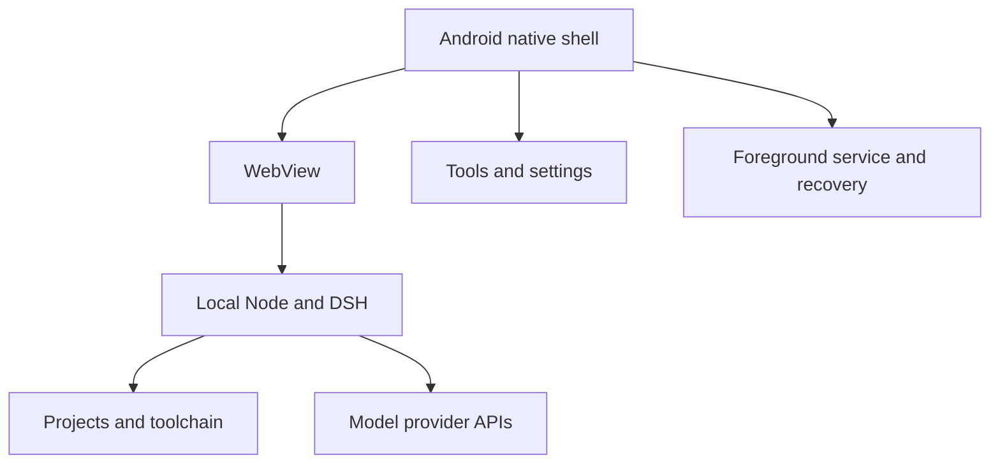

# DSH Native · DeepSeek Harness on Android

<!-- dsh-doc-status:start -->
> Maintained documentation for the current source. Published stable: **0.33.11**; source: **0.33.11**; source payload: `payload-v12`; pinned DSH: `0.2.0-rc.2` (upstream release candidate). [Current status and verification boundaries](docs/STATUS.md).
<!-- dsh-doc-status:end -->

[中文](README.md) · [English](README.en.md) · [Documentation](docs/README.md) · [Project status](docs/STATUS.md)

**Keep your project on your phone and bring the DSH workflow to Android.**

DSH Native packages Android-native Node.js, DeepSeek Harness (DSH), and development tools into an Android application. Chat, run agents, edit files, and manage tasks in local projects without installing Termux or proot or setting up a remote execution server.

Model inference uses your selected provider's API. Project storage and tool execution are local; messages, attachments, and tool results are transmitted according to DSH and the provider's request behavior. This is an independent Android adaptation project.

## Download and requirements

**Current stable release: 0.33.11**

**[Download DSHNative-bootstrap.apk](https://github.com/yusheng266186-beep/DSH-Native/releases/download/v0.33.11-bootstrap/DSHNative-bootstrap.apk)** (33.7 MiB)

[Release notes](https://github.com/yusheng266186-beep/DSH-Native/releases/tag/v0.33.11-bootstrap) · [All releases](https://github.com/yusheng266186-beep/DSH-Native/releases)

SHA-256: `9057df396b5f4131b65ef991cc84806637f2a9d372c39b671e7da49472008508`

| Item | Requirement or behavior |
|---|---|
| Android | Android 7.0 or later; minSdk 24 |
| CPU | ARM64; no ARM32 or x86 package is currently provided |
| First launch | Downloads a roughly 120.9 MiB runtime; later updates download changed parts |
| Storage | Allow room for extraction, downloads, and rollback snapshots; reserve 1.5–2 GiB and follow the App's actual space check |
| Model access | Command Code API key, DeepSeek API key, or DeepSeek account authorization; models and quotas depend on your account |
| Background tasks | Allow notifications and background operation as appropriate for your device; a foreground service cannot prevent every ROM from terminating the process |

The APK carries Node and bootstrap logic. DSH and the toolchain are installed from runtime parts verified by hash. Extracted storage is considerably larger than compressed downloads, and safe updates require additional snapshot space.

**Upgrade by installing the same-signed new APK over the existing App.** Uninstalling removes private sessions, credentials, and settings. A configuration backup does not back up all projects or conversation history.

## From installation to your first task

1. Install the APK and grant the requested file and notification permissions.
2. Select a language and complete runtime download, SHA-256 verification, and extraction.
3. Open Model Center and enter a Command Code / DeepSeek API key, or use DeepSeek account & balances to authorize in your browser.
4. Fetch the provider's live model directory, choose a default model and effort, and save.
5. Use the default workspace or create a named project, then start a new conversation.

Native language settings offer system default, Chinese, and English. DSH WebUI language and theme are controlled separately in the web settings; native panels follow the web theme. Existing installations with `.dsh` data are not forced through first-run onboarding again.

### Finding App tools

Expand the DSH sidebar and select **App tools** at the bottom. Open **Model center** for **Refresh models**. **App tools → DeepSeek account** opens DSH’s original **Account** settings with a shortcut in Model center.

Fallback entry points include a long press on the top of the page, the notification's settings action, and launcher shortcuts for settings, logs, and updates. The web gear continues to open DSH's own settings.

Visible back buttons, the Android back button, and edge gestures follow the same parent navigation in native subpages.

## Workflows and capabilities

| Workflow | Current capabilities |
|---|---|
| Local agent | DSH and Android/bionic Node in the private App directory, with git, rg, fd, jq, bash, Python, and other tools |
| Models | Live provider catalog, global defaults, project overrides, per-model effort, and a Max request option for every model |
| Projects and files | Named projects, file browsing and text editing, image preview, batch copy/move, recoverable trash |
| Share import | Import text or files from other Apps into the current project and explicitly create a task |
| Tasks and connection | Task center, timeline, approval alerts, background completion notifications, WebSocket status, local draft recovery |
| Conversations | Entry points to official DSH search, archive, and restore UI |
| Maintenance | App/runtime updates, runtime snapshots and recovery, network diagnostics, logs, redacted diagnostic ZIP |
| Configuration backup | Authenticated encryption with a password of at least eight characters; includes credentials, the active Web profile, and global/project model settings |
| Plugins | Built-in management and external installation, with capability disclosure and version-fingerprint authorization |

### Models come from your provider account

| Route | Directory endpoint | Behavior |
|---|---|---|
| Command Code | `GET https://api.commandcode.ai/provider/v1/models` | Authenticated directory visible to your account |
| Direct DeepSeek | `GET https://api.deepseek.com/models` | Directory returned for your official API key |
| DeepSeek account | Core `account/*` and `session/modelCatalog` | Core-managed account model route after browser authorization |

DSH’s original account page shows account details, topped-up and granted balances, usage, top-up and sign-out actions. Sign-in opens DeepSeek's authorization page in your browser. After authorization, return to the App, choose **DeepSeek account**, fetch the model list, and save. You can reopen authorization, cancel a pending attempt, or sign out. API keys and account authorization are stored separately. Signing out stops tasks using that account and retains API keys, sessions, and projects. See [account integration and verification boundaries](docs/DEEPSEEK_ACCOUNT.md).

Connection checks read the directory without sending a test prompt. The native picker displays IDs from the current successful response. Local capability records explain effort and image support; they do not fabricate models unavailable to your account.

New IDs remain selectable even when absent from the local capability snapshot. Structured upstream declarations take priority for image support, followed by existing configuration. Unknown capability is not labeled as image support. Saved settings can be retained during temporary offline operation; initial setup or choosing a new model requires a successful live fetch.

**Refresh models** writes the complete successful catalogs directly to DSH's provider configuration. A controlled runtime reload applies them when idle, followed by a page refresh. Running or unknown task state defers application until confirmed idle. Reloading WebView alone cannot rebuild the provider topology.

Global and project defaults apply to new conversations. Existing history is retained; the chat model picker can explicitly change the model or effort for subsequent requests. Already dispatched requests are not changed retrospectively.

### Effort: provider declarations and Max requests

The App retains declared levels such as `off`, `minimal`, `low`, `medium`, `high`, and `xhigh`, and adds a literal `max` request option to **every model**. The composer labels it **Max (request)**.

| Example | Pinned capability declaration | Options offered by the App |
|---|---|---|
| Space Bunny `stealth/space-bunny-alpha` | low / medium / high | Declared levels + Max (request) |
| `Qwen/Qwen3.8-Max` | low / medium / xhigh | Declared levels + Max (request) |
| Automatic, non-adjustable, or unknown models | No reliable adjustable-effort declaration | Provider default (omit the parameter) + Max (request) |
| Direct DeepSeek | off / low / high / max | Existing levels, with literal max transmitted |

**Selecting max means the client submits that parameter; it does not guarantee a larger reasoning budget.** A provider may honor, ignore, or reject it. The App does not silently downgrade to high or present the option as proven model capability.

See [Model reasoning](docs/MODEL_REASONING.md) for the complete table, provenance, precedence, migration behavior, and test boundaries.

### Projects, files, and conversations

The default workspace is `/sdcard/DSHNative/workspace`; named projects live under `projects/<name>` and can have their own model defaults.

File writes are restricted by canonical-path allowlists. Directory copies do not follow symlinks. Deletion normally moves files to same-volume trash; restoration preserves both copies when a name conflicts. Text editing includes unsaved-change handling and safe save behavior.

Draft recovery restores local text without sending it. Official DSH UI handles conversation search, archive, and restoration. Configuration backup excludes full workspaces, complete history, and attachments; back up project files separately.

### Updates and recovery

| Operation | Scope |
|---|---|
| App update | Verify version, package, signature, and checksum, then invoke Android's installer |
| Runtime update | Verify parts and replace changed DSH/toolchain content |
| Restore previous runtime | Verify and restore `dsh` / `tools` snapshots while retaining `.dsh` and projects; no APK downgrade |
| Export diagnostics | Device, layout, connection, runtime, rollback summaries, and redacted logs; excludes keys, conversation content, attachments, and project files |

Stable clients read `latest.json`. Test-channel clients compare it with `latest-test.json` and select the higher version. Each published manifest stays bound to its own APK and payload.

Runtime updates check space and take a snapshot before replacement, with recovery on failure. Automatic recovery holds further updates to avoid a startup loop. The pinned DSH core is `0.2.0-rc.2`, an **upstream release candidate**; the App's stable channel is independent of that upstream designation.

## Data and permission boundaries

- Credentials live in private `.dsh/.credentials.yaml`; model settings also involve profile patches and project overrides.
- Logs and diagnostics redact secrets; catalog response bodies and authentication headers are not logged.
- Web assistance uses restricted injection and message handling, without a high-privilege `JavascriptInterface`.
- File operations are limited to the private App directory and `/sdcard/DSHNative`, with canonical-path and symlink escape checks.
- External plugins execute in the local tool environment; review their disclosed capabilities before authorization.
- The App provides neither root privileges nor a full Linux distribution. Model inference requires your provider to be available.

## Architecture



Two-stage delivery separates the APK from the larger runtime. Node, libraries, bootstrap scripts, and an initial manifest ship in the APK. Runtime parts contain DSH and tools, with revisions, sentinels, sizes, and SHA-256 used for update decisions.

Logic for path safety, model capability, update decisions, task status, and recovery is separated from Android UI and tested on a normal JVM. Native views use `DshUi`; asynchronous callbacks validate lifecycle state. Theme-driven recreation uses debouncing, persistent rate limiting, and a hard stop.

The current architecture keeps `targetSdk 28` because executables run from private App storage. Raising it requires redesigning executable deployment rather than changing a routine release setting.

## Development and verification

Local checks require a JDK, Python 3, and Node.js. Complete Linux builds additionally need Android SDK, GitHub CLI, and access to a previous stable APK.

```bash
python3 scripts/check_java.py
bash scripts/run_tests.sh
python3 scripts/sync_project_metadata.py --check --allow-unpublished-source

# Linux with Android SDK already installed
bash scripts/ci_build.sh /tmp/dsh-build
```

The output is `/tmp/dsh-build/bootstrap/DSHNative-bootstrap.apk`. Actions uses JDK 17, official Linux build-tools 34.0.0, and Android 28/34 platform files. See [Build guide](docs/BUILD.md).

Regression covers JVM logic, JS page/connection simulations, local HTTP authentication, release metadata, and the actual runtime's Host, model catalogs, SDK request bodies, session persistence, and Web profile. Composer tests run the real React selector for both locales and verify model/max RPCs. Test counts are taken from the current CI output.

Real-payload tests also measure send, attachment, file-tab close and settings controls in touch Chromium across six width/orientation/language/theme scenarios. See the [layout handover](docs/HANDOVER-LAYOUT.md) for reproduction and verification boundaries.

These checks do not prove Android device layout, providers' real execution of max, or background reliability across every ROM. Evidence and remaining verification are recorded in [Project status](docs/STATUS.md).

### Documentation is part of release synchronization

```bash
python3 scripts/sync_project_metadata.py --docs-only
python3 scripts/sync_project_metadata.py --docs-only --check
```

After release assets and download routes are verified, `release.yml` / `release.sh` generates manifests and synchronizes both READMEs, every document's status block, and the current status table. Historical iteration content is retained. Do not edit generated blocks manually. Source can lead the published release, but documentation must show both accurately.

## Repository map

| Path | Responsibility |
|---|---|
| `src/dev/dsh/nativeapp/` | Native shell, pure logic, panels, foreground service |
| `payload/` | Download, extraction, preflight, snapshots, runtime helpers |
| `runtime/` | Pinned core source, integrity, dependency lock |
| `patch/` | Android compatibility notes and explicitly archived patches |
| `tests/` | Java, JS, HTTP, and actual-runtime consumer regression |
| `scripts/` | Build, signing, releases, payload generation, documentation sync |
| `docs/` | Current guides, status, handover, historical phases and research |
| `release-notes/` | Separate version-specific App and payload changes |

Start with [Documentation](docs/README.md). Before development, read [AGENTS.md](AGENTS.md), [Handover](docs/HANDOVER.md), and [Gotchas](docs/GOTCHAS.md).

## Limits and provenance

ARM64 only; first initialization requires network access; Android and ROM policies constrain background operation; unknown image capability is not guessed. A large Office-to-PDF engine is not bundled. Runtime restoration covers DSH/tools, not APK downgrade or full data recovery.

Repository code is licensed under [MIT](LICENSE). DSH, Node.js, Termux-origin binaries, and other bundled components retain their own licenses; the repository license does not relicense all dependencies.

- [DeepSeek Harness upstream](https://github.com/deepseek-ai/deepseek-harness)
- [Termux](https://github.com/termux/termux-app)
- [Pinned core and upgrade notes](docs/CORE_UPGRADE.md)
- [Android 10 behavior changes](https://developer.android.com/about/versions/10/behavior-changes-10)
