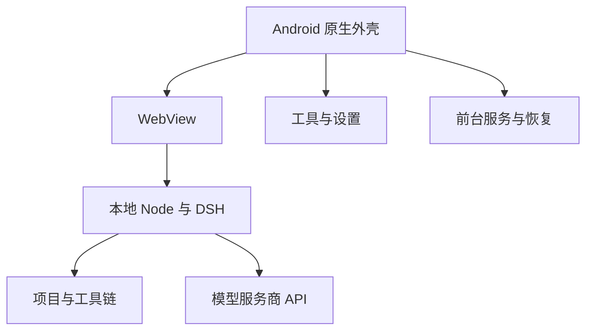

# DSH Native · Android 上的 DeepSeek Harness

<!-- dsh-doc-status:start -->
> 现行文档：按当前源码维护。 已发布 stable：**0.33.7**；源码：**0.33.8**；源码运行包：`payload-v12`；固定 DSH：`0.2.0-rc.2`（上游候选版）。[统一进度与验证边界](docs/STATUS.md)。
<!-- dsh-doc-status:end -->

[中文](README.md) · [English](README.en.md) · [文档中心](docs/README.md) · [项目状态](docs/STATUS.md)

**把项目留在手机上，把完整的 DSH 工作流带到 Android。**

DSH Native 将 Android 原生 Node.js、DeepSeek Harness（DSH）和常用开发工具封装为一个 Android 应用。你可以在本地项目中聊天、运行 agent、编辑文件和管理任务，无须另外安装 Termux 或 proot，也无须配置远程执行服务器。

模型推理仍通过所选服务商的 API 完成。项目文件与工具执行位于设备端；发送给模型的消息、附件和工具结果按 DSH 与服务商的调用方式传输。本项目是独立的 Android 适配项目。

## 下载与运行要求

**当前版本：0.33.7**

**[下载 DSHNative-bootstrap.apk](https://github.com/yusheng266186-beep/DSH-Native/releases/download/v0.33.7-bootstrap/DSHNative-bootstrap.apk)**（33.7 MiB）

[正式版发布说明](https://github.com/yusheng266186-beep/DSH-Native/releases/tag/v0.33.7-bootstrap) · [历史版本](https://github.com/yusheng266186-beep/DSH-Native/releases)

SHA-256：`930908608c0f50e7e73e4f2c80e8849785b547109a88f01afe4bcc6f96df6cdc`

| 项目 | 要求与说明 |
|---|---|
| 系统 | Android 7.0 及以上，minSdk 24 |
| CPU | ARM64；当前没有 ARM32 或 x86 安装包 |
| 首次启动 | 联网下载约 120.9 MiB 运行包；后续按变化分片更新 |
| 存储 | 为展开、临时下载和回滚快照留出空间；建议预留 1.5–2 GiB，实际需求以 App 空间预检为准 |
| 模型服务 | Command Code 或 DeepSeek 官方 API 凭据；可见模型与额度由账户决定 |
| 后台任务 | 建议允许通知，并按手机系统设置允许后台运行；前台服务无法保证所有 ROM 都不回收进程 |

APK 携带 Node 与启动引导，DSH 和工具链通过经过摘要校验的运行包分片安装。完整环境展开后的占用明显大于压缩下载量，更新前的安全快照还需要额外空间。

**升级请直接覆盖安装同签名新版。** 卸载会清除 App 私有目录中的会话、凭据和配置；配置备份也不等于全部项目与历史的备份。

## 从安装到第一项任务

1. 安装 APK，按提示授予所需的文件与通知权限。
2. 完成语言选择和运行环境初始化，等待分片下载、SHA-256 校验及解压。
3. 打开模型中心，选择 Command Code 或 DeepSeek 官方直连，填写 API Key。
4. 读取服务商实时模型目录，选择默认模型与思考强度并保存。
5. 使用默认工作区，或创建命名项目；打开新会话开始任务。

原生界面的语言可以选择跟随系统、中文或 English。DSH WebUI 的语言与主题由网页自己的设置控制；原生面板会跟随网页主题。已有 `.dsh` 数据的升级用户不会被强制再次进入首次配置向导。

### App 工具在哪里

展开 DSH 侧边栏，在底部点击 **App 工具 / App tools**。同一区域还提供 **更新模型列表 / Refresh models**，两项入口纵向排列，避免在窄屏挤压。

备用入口包括长按页面顶部、通知栏的设置操作，以及长按桌面图标后的设置、日志、更新快捷方式。DSH 网页中的齿轮继续打开网页自己的设置。

原生子页的可见返回按钮、Android 返回键和边缘返回手势使用同一父级导航。

## 能做什么

| 工作流 | 当前能力 |
|---|---|
| 本地 agent | 在 App 私有目录运行 DSH 与 Android/bionic Node，使用 git、rg、fd、jq、bash、Python 等工具 |
| 模型与参数 | 实时服务商目录、全局默认、项目覆盖、逐模型思考档位和全模型 Max 请求选项 |
| 项目与文件 | 命名项目、浏览与文本编辑、图片预览、多选复制/移动、可恢复回收站 |
| 分享导入 | 将其他 App 的文本或文件导入当前项目，并显式创建任务 |
| 任务与连接 | 任务中心、时间线、等待批准提醒、后台完成通知、WebSocket 状态和本地草稿恢复 |
| 会话管理 | 进入 DSH 官方会话搜索、归档及恢复界面 |
| 运维与恢复 | App / 运行包更新、运行环境快照与恢复、网络诊断、日志、脱敏诊断 ZIP |
| 配置备份 | 以至少 8 位口令导出认证加密的配置备份，包含凭据与全局/项目模型设置 |
| 插件 | 内置插件管理与外部插件安装入口，披露能力并按版本指纹授权 |

### 模型目录：以账户实际返回的列表为准

| 路由 | 目录端点 | 读取行为 |
|---|---|---|
| Command Code | `GET https://api.commandcode.ai/provider/v1/models` | 使用当前账户认证，获取可见模型 |
| DeepSeek 官方直连 | `GET https://api.deepseek.com/models` | 使用官方 API Key，获取可见模型 |

连接检测只读取目录，不发送测试提示词。原生选择器只展示本次成功响应返回的模型 ID；本地能力表用于解释参数与视觉能力，不用于补造账户不可见的模型。

服务商新增模型即使尚未进入本地能力表，也允许选择和保存。视觉能力优先采用上游结构化声明，再结合已有配置；未知能力不会被误标为支持图片。临时离线时可以保留已保存配置，首次配置或选择新模型需要成功读取目录。

点击 **更新模型列表** 后，成功读取的服务商完整目录直接写入 DSH 的 provider catalog。空闲时通过受控的运行时重载应用并刷新页面；任务运行或状态未知时先保存，确认空闲后再应用。单独刷新 WebView 不能更新已经构建的服务商拓扑。

全局和项目默认模型用于新会话。已有会话保留历史记录；你也可以在聊天框的模型选择器中显式改变后续请求所使用的模型或思考强度，已经发出的请求不会被追溯修改。

### 思考强度：官方声明与 Max 请求分开理解

App 保留各模型已有的 `off / minimal / low / medium / high / xhigh` 等声明，并为**所有模型**追加字面量 `max` 请求选项。聊天框显示 **Max（请求）/ Max (request)**。

| 示例 | 固定能力快照中的档位 | App 当前提供 |
|---|---|---|
| 太空兔子 `stealth/space-bunny-alpha` | low / medium / high | 原档位 + Max（请求） |
| `Qwen/Qwen3.8-Max` | low / medium / xhigh | 原档位 + Max（请求） |
| 未公布档位、自动推理或未知新模型 | 没有可靠的可调档位声明 | 服务商默认（不传参数）+ Max（请求） |
| DeepSeek 官方直连 | off / low / high / max | 保留原档位，max 按字面量请求 |

**能选择 max，表示客户端会提交这个参数；不能保证服务商实际提供更大的思考预算。** 上游可能执行、忽略或拒绝它。App 不会偷偷改成 high，也不会把选项展示当作已验证的模型能力。

完整模型对照、来源优先级、升级保留规则和测试范围见 [模型思考强度](docs/MODEL_REASONING.md)。

### 项目、文件与会话

默认工作区为 `/sdcard/DSHNative/workspace`，命名项目位于其 `projects/<项目名>` 子目录；各项目可以设置独立的模型默认值。

文件写入受规范路径白名单约束。目录复制不跟随符号链接；删除默认进入同卷回收站，恢复遇到同名文件会保留两份。文本编辑包含未保存提示与安全保存路径。

草稿恢复只恢复本地输入，不自动发送。会话搜索、归档和恢复继续由 DSH 官方 UI 完成。配置备份不包含完整工作区、全部历史或附件，需要保存的项目文件应另行备份。

### 更新与恢复

| 操作 | 影响范围 |
|---|---|
| 更新 App | 校验版本、包名、签名与摘要，调用系统安装器覆盖安装 |
| 更新运行包 | 校验分片，仅替换变化的 DSH / 工具链内容 |
| 恢复上一运行环境 | 校验并恢复 `dsh` / `tools` 快照，保留用户 `.dsh` 与项目；不降级 APK |
| 导出诊断 ZIP | 设备、布局、连接、运行包和回滚摘要及脱敏日志；排除密钥、会话正文、附件与项目文件 |

稳定通道读取 `latest.json`；测试通道同时比较稳定与 `latest-test.json`，选择更高版本。测试清单保留其自身 APK 对应的运行包，不随稳定版随意改写。

运行包更新采用先预检和快照、后替换、失败恢复的顺序。自动恢复后会暂缓再次更新，避免启动循环。当前固定内核是 DSH `0.2.0-rc.2`，属于**上游候选版**；App 的 stable 通道与上游内核的发布级别是两个概念。

## 数据与权限边界

- 凭据位于 App 私有 `.dsh/.credentials.yaml`；模型设置还涉及 profile patch 和项目覆盖文件。
- 日志与诊断输出脱敏，模型目录响应正文和认证头不写入日志。
- 网页辅助功能使用受限注入与消息处理，不引入高权限 `JavascriptInterface`。
- 文件操作限定在 App 私有目录和 `/sdcard/DSHNative`，并检查规范路径与符号链接逃逸。
- 外部插件运行于本地工具环境，授权前应查看其能力披露。
- App 不提供 root 权限，也不包含完整 Linux 发行版；模型推理需要所选服务商可用。

## 架构与工程设计



两段式分发让 APK 与庞大的运行环境独立升级：APK 内包含 Node、动态库、引导脚本与初始清单；运行包包含 DSH 与工具链，分片使用修订号、哨兵、大小与 SHA-256 判断是否需要更新。

原生判断逻辑独立于 Android UI，包括路径安全、模型能力、更新决策、任务状态和恢复策略，可在普通 JVM 上验证。UI 统一使用 `DshUi`，异步回调复核页面生命周期，主题重建具备去抖、跨重建限流与硬停止。

当前架构固定 `targetSdk 28`，因为 Node 与工具在私有数据目录执行。提高 targetSdk 需要先重新设计可执行文件的部署方式，不能作为普通版本升级顺带调整。

## 开发与验证

本地逻辑检查需要 JDK、Python 3 和 Node.js；完整 Linux 构建还需要 Android SDK、GitHub CLI 和可获取上一正式 APK 的网络环境。

```bash
python3 scripts/check_java.py
bash scripts/run_tests.sh
python3 scripts/sync_project_metadata.py --check --allow-unpublished-source

# 在已安装 Android SDK 的 Linux 环境准备并构建
bash scripts/ci_build.sh /tmp/dsh-build
```

完整构建产物为 `/tmp/dsh-build/bootstrap/DSHNative-bootstrap.apk`。GitHub Actions 使用 JDK 17、官方 Linux build-tools 34.0.0 与 Android 28/34 平台文件；详见 [构建指南](docs/BUILD.md)。

回归覆盖纯 JVM 逻辑、JS 页面与连接模拟、HTTP 认证探测、发布元数据，以及真实运行包的 Host / 模型目录 / SDK 请求体 / 会话持久化 / Web profile。聊天框回归执行真实 React 模型选择组件，验证中英文下的模型与 max RPC。实际测试数量以本次 CI 输出为准。

这些测试不等同于 Android 真机布局、真实服务商 max 执行效果或所有 ROM 的后台行为验证；具体证据与待验证范围记录在 [项目状态](docs/STATUS.md)。

### 文档也进入发布闭环

```bash
# 编辑后同步所有文档的状态块和生成模型表
python3 scripts/sync_project_metadata.py --docs-only

# 核对状态、生成表和本地链接
python3 scripts/sync_project_metadata.py --docs-only --check
```

`release.yml` / `release.sh` 在确认资产和下载路径后生成清单，再同步中英文下载信息、全部文档状态与当前状态表。阶段记录保留历史内容；生成区禁止手工修改。源码可以领先已发布版本，但文档必须如实显示两者。

## 仓库导航

| 路径 | 职责 |
|---|---|
| `src/dev/dsh/nativeapp/` | 原生外壳、纯逻辑层、面板与前台服务 |
| `payload/` | 下载、解压、空间预检、快照与运行时辅助 |
| `runtime/` | 固定内核来源、摘要与依赖锁定 |
| `patch/` | Android 兼容层说明及明确归档的旧补丁 |
| `tests/` | Java、JS、HTTP 与实际运行包消费回归 |
| `scripts/` | 构建、签名、发布、运行包生成和文档同步 |
| `docs/` | 当前指南、统一进度、交接、历史阶段和研究记录 |
| `release-notes/` | 不同 App / payload 版本的独立变更说明 |

从 [文档中心](docs/README.md) 开始；开发前阅读 [AGENTS.md](AGENTS.md)、[交接说明](docs/HANDOVER.md) 与 [踩坑记录](docs/GOTCHAS.md)。

## 已知限制与来源

目前仅支持 ARM64；首次初始化依赖网络；后台持续运行受 Android 与 ROM 策略约束；未知模型视觉能力不会被猜测；未打包大型 Office 到 PDF 转换引擎。运行环境恢复仅处理 DSH / 工具链，不是 APK 降级或完整数据恢复。

本仓库代码采用 [MIT License](LICENSE)。DSH、Node.js、Termux 来源二进制和其他运行包组件保留各自许可证，不能将本仓库的 MIT 许可直接套用到所有打包依赖。

- [DeepSeek Harness 上游](https://github.com/deepseek-ai/deepseek-harness)
- [Termux 项目](https://github.com/termux/termux-app)
- [固定内核与升级说明](docs/CORE_UPGRADE.md)
- [Android 10 行为变更](https://developer.android.com/about/versions/10/behavior-changes-10)
