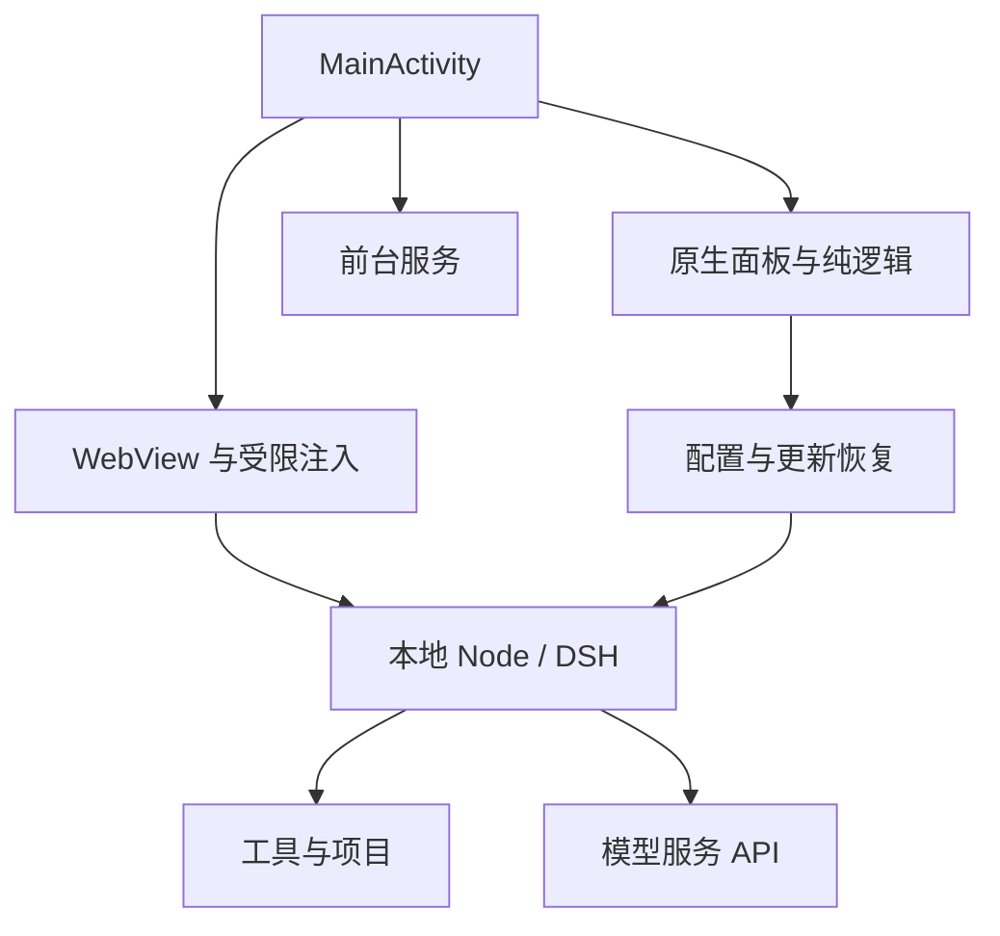
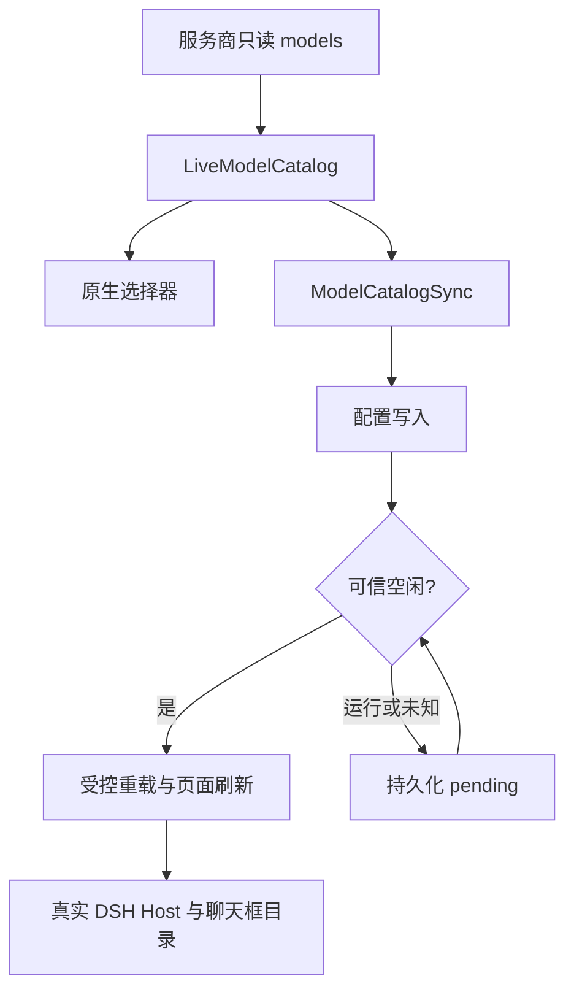

# 架构与运行边界

<!-- dsh-doc-status:start -->
> 现行文档：按当前源码维护。 已发布 stable：**0.33.3**；源码：**0.33.3**；源码运行包：`payload-v12`；固定 DSH：`0.2.0-rc.2`（上游候选版）。[统一进度与验证边界](STATUS.md)。
<!-- dsh-doc-status:end -->

## 1. 目标与约束

DSH Native 提供 Android 本地项目、工具执行与 DSH WebUI。模型请求使用远端服务商 API。App 不依赖用户安装 Termux/proot，也不是 root 环境或完整 Linux 发行版。

仓库包名 `dev.dsh.native`，minSdk 24、targetSdk 28，发布 ARM64 APK。Node 与工具来自 Android/bionic 构建；glibc 版本不能互换。当前私有目录可执行方案限制 targetSdk 迁移。

## 2. 组件与数据流

| 边界 | 职责 |
|---|---|
| 原生整合 | 启动、安装、权限、配置、进程与页面生命周期 |
| WebView | DSH 交互、模型聊天框、官方会话操作 |
| 纯逻辑 | 路径、能力、模型归一化、版本、状态机、空间与恢复决策 |
| 前台服务 | 常驻任务看板及通知；实际存活仍受 Android/ROM 控制 |
| DSH runtime | provider topology、agent、会话、插件、工具执行 |
| 分发层 | APK、payload 及独立 stable/test 清单 |

原生与网页之间使用限定用途的消息与脚本；不暴露任意文件/命令执行的高权限 `JavascriptInterface`。

## 3. 两段式分发与空间

APK 携带 Node、所需动态库、引导脚本与初始清单；DSH 和工具链通过 payload 分片安装。实际 APK 与全量 payload 体积在 [STATUS](STATUS.md) 生成表，不在多个文件手写重复维护。

| 分片 | 当前作用 |
|---|---|
| DSH | CLI、模块、WebUI 与依赖；v10 修订 5 |
| 工具四片 | git/Python/npm/curl 等；从 v9 原样复用修订 4 |

`PayloadUpdate` 按修订号和哨兵判断变化，下载校验大小与 SHA-256。`remove` 显式列举旧文件删除，避免只删文件的更新因为哨兵没变而被跳过。

v10 DSH 部分的 `unpacked_size` 按展开后文件块与目录占用计算，约 491 MiB；它不是全 App 总占用。预检还包含其余工具、下载缓存、更新前快照与余量；旧 manifest 兼容估算不能代替新字段。不要继续使用旧 316MB 展开总量或 550MiB 安装建议。

内核来源、归档完整性和依赖锁在 `runtime/core-source.json` 与 `runtime/core-package-lock.json`。payload 必须先独立完整发布，App 才引用该标签；App 运行包标签目前取自源码，不只依赖 latest 清单的信息字段。

## 4. 本地目录与配置层

`<root>` 表示 `getFilesDir()/dsh`，包含 Node 引导、`dsh`、`tools` 与用户 `.dsh`。共享工作区默认 `/sdcard/DSHNative/workspace`，命名项目放其 `projects/<name>`；不可用时由原生工作区解析逻辑处理回退。

| 数据 | 边界 |
|---|---|
| `.dsh/.credentials.yaml` | 用户凭据与 DSH 本地认证资料，不进入日志或运行包 |
| legacy `settings.yaml` | 原生配置写入/导入入口；当前 DSH 可能迁移到 profile patch |
| `.dsh/profiles/web/cordis.patch.yml` | Web profile 配置层；排查时与实际启动 patch 一并检查 |
| `.native-project-models` | 全局基线与项目模型覆盖，加入加密配置备份 |
| 会话与附件 | 用户数据；不在 payload 删除和 runtime 恢复目标内 |
| 工作区 | 项目文件；配置备份不包含完整工作区 |

配置叠加涉及 bundle、profile 和启动器 `--patch`；CLI 顺序要求 patch 在 profile 前。升级合并静态传输字段时保留 live catalog 标记模型，不重置用户目录和能力。

## 5. 模型目录与调用配置

可见 ID 来自当前成功上游响应。能力优先级为上游明确声明、对应服务商固定能力记录、已有自定义配置；能力表不增删可见 ID。未知模型仍允许选择，未知视觉能力不推断成图片支持。

Command Code 目录写入 `llm-pi-ai.providers.commandcode.models`；DeepSeek 直连写入 `llm-deepseek-api-key.models`。刷新目录不要求修改默认模型；空/失败响应不能清空上一份有效目录。

已构建的 runtime topology 不会因 WebView reload 自动重建，因此成功写入后必须空闲再重载。running 或 unknown 保存 pending；目录应用与主题/生命周期变动均需有界、去抖与限流。

`ModelReasoning.supportedDeclaration` 保留支持来源；`declaration` 为所有模型追加 `max: max`，原 max 别名也覆盖为字面量。无可调声明模型保留 `off: null` 的无参数默认调用。

`ModelEffortUi` 对实际 client 模块有锚点、幂等修改标签为 Max（请求），结构不匹配时不写入。不静默改变用户选择或改写历史。全局/项目默认影响新会话；当前会话选择器可明确修改后续请求。

完整固定快照与回归见 [MODEL_REASONING](MODEL_REASONING.md)。

## 6. 会话证据、连接与恢复

`SessionProbe` 在前端模块前捕获实际认证列表 RPC，解析完整 JSON，不依赖不存在的固定 REST URL。已观察请求每 5 秒重放并使用新 rpcId；90 秒没有可信数据则未知。列表的 `running` 是运行权威，DOM 只补充审批状态。

`ConnectionRecovery` 分开表示设备网络与 DSH WebSocket，不用“有网”替代连接成功。任务运行或等待批准时不能自动刷新去修连接。恢复后的活动任务先标为恢复中，收到新证据才判断结束/运行。

`DraftRecovery` 仅在 DSH localhost origin 恢复本地草稿，不自动发送、不新增权限桥。官方 DSH UI 管理搜索、归档、停止与取消归档，原生不另造未验证内部 RPC。

`LocalServerProbe` 在同一 origin 处理 token/303/Cookie，限时、限大小、限跳转；跨 origin 立即拒绝，避免认证泄露和重复启动。

## 7. 更新、快照与数据保护

更新前空间预检和快照覆盖运行环境，替换失败时恢复。`PayloadRollback` 验证 journal、大小、SHA-256 和安全目标，只能恢复 `dsh` / `tools`，不把 `.dsh` 或项目纳入快照目标。

自动恢复后设置更新暂缓，直到用户主动更新成功才解除。手动恢复不降低 APK，也不要求清除 App 数据。覆盖安装必须同包名同签名。

配置备份认证加密并要求至少 8 位密码，恢复检查 zip-slip；不是完整数据备份。诊断 ZIP 只含摘要与脱敏日志，排除配置全文、凭据、会话正文、附件和项目文件。

## 8. Android 兼容层

| 兼容点 | 当前处理 | 验证边界 |
|---|---|---|
| Node 内部模块 | 纯 JS 垫片配合 `--expose-internals` | 保留当前入口及真实 profile 消费验证 |
| PTY | 复用已发布 Android/bionic ELF | Linux 容器不证明手机 ELF 实际加载 |
| 图片 | sharp API 的窄范围实现委托 Python/Pillow | 需要真机图片与服务商能力回归 |
| flock | 仅 Android 无原生绑定时使用降级；桌面用真实锁并传播错误 | no-op 不提供跨进程互斥 |
| 会话发布 | 硬链接优先；兼容性失败用 `COPYFILE_EXCL`，拒绝覆盖 | 磁盘满等其他错误继续传播 |

`patch/02-session-link-to-rename` 保留旧补丁但已归档。“先检查后 rename”不能维持原子排他发布，禁止用于 v10。升级附件补丁不能沿用旧 `.dshorig` 作为新源码。

## 9. 构建与验证闭环

Actions 在 Linux 用官方 build-tools；Node/动态库从上一 bootstrap APK 取出，不提交大型二进制。资源包括图标、主题、快捷方式与动效，不能笼统称“零资源 APK”。

测试分层：纯 JVM、JS/HTTP 模拟、真实运行包消费、Android 编译/DEX/资源/签名、真机反馈、真实服务商效果。CI 逻辑与消费回归不能证明所有手机行为。

文档事实也进入发布验证：自动生成状态块、STATUS 表和固定模型表，检查本地链接，正式发布同步双 README 的下载与摘要。当前完成范围及未验证矩阵见 [STATUS](STATUS.md)，发布方法见 [BUILD](BUILD.md)。
